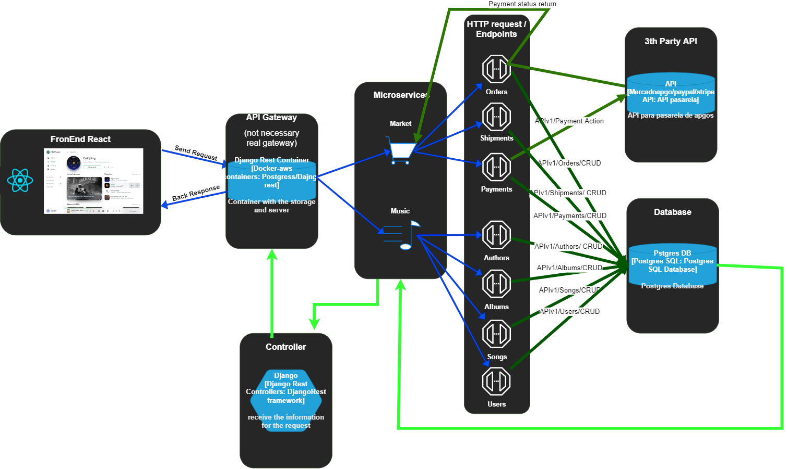
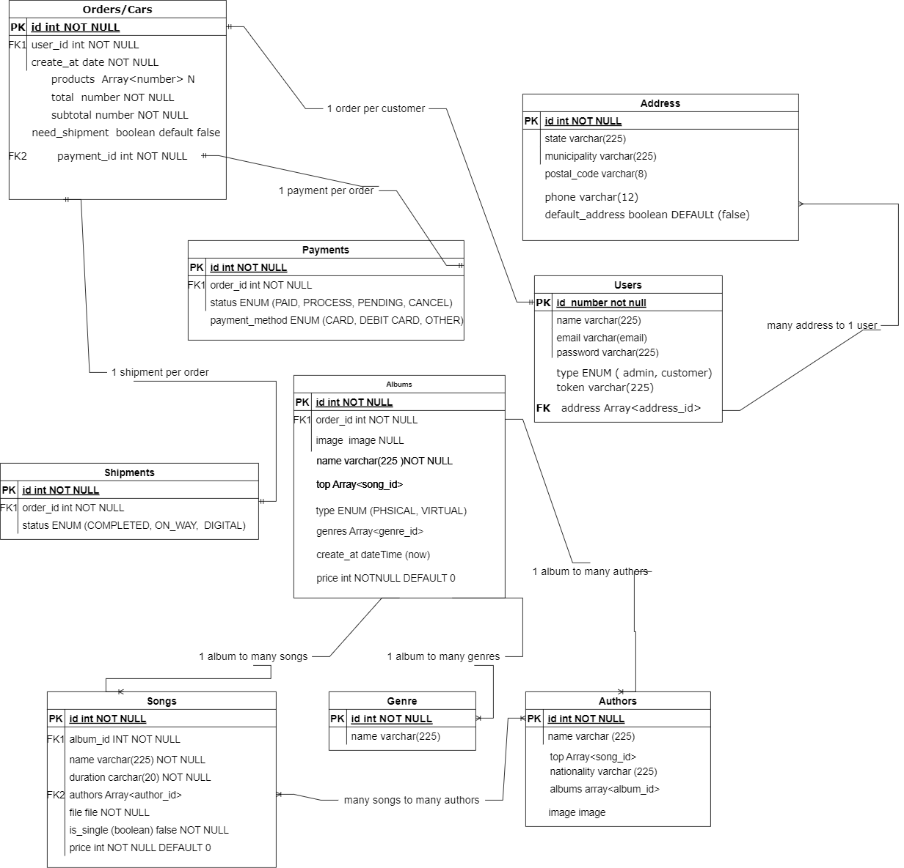

# Documentation for music app

## Structure of App
### Mock of services for the app

### ER Diagram / databse structure

### App requirements
El proyecto final debe constar de una tienda de música, ésta tienda permitirá comprar al usuario final dos tipos de canciones: físicas y virtuales. Si el formato es físico obviamente no va a poder comprar una canción solamente a menos que sea un disco del tipo "Single", tendrá que comprar todo el álbum. 

Si es virtual el usuario podrá comprarlas canciones individualmente, obviamente el precio del álbum físico debe ser diferente al del virtual. Las canciones deben contar con un identificador de álbum, nombre, duración, lista de artistas, archivo y preview, si el usuario previamente compró el álbum o la canción, sin importar que sea virtual o físico debe poder escuchar la canción completa (Si el usuario compra la canción en físico también debe poder escucharla de manera virtual), de otra manera solo podrá escuchar el preview qué constará de los 15 segundos más significativos de la canción. 

Los artistas deben tener nombre, nacionalidad, álbumes y top 5 de canciones más escuchadas. Los álbumes deben tener imagen, nombre, géneros, lista de id de canciones, fecha de lanzamiento. 

Existirán dos tipos de usuarios el comprador y el administrador, el comprador podrá crear playlist con las canciones que ha comprado, deberá tener una lista de direcciones, en la cual tendrá una dirección por default para mandar los álbumes físico que haya comprado pero también podrá cambiar ésta dirección al momento de la compra, podrá buscar los álbumes o canciones por nombre, género, álbum o artista. Al igual que los podrá ordenar para que aparezcan ordenados de manera ascendente o descendente utilizando la fecha se subida como referencia, está funcionalidad también debe aplicar para las canciones en una playlist.

La compra solamente debe tener un arreglo de álbumes o canciones (Según a usted le parezca debido), la fecha de la compra, usuario y el ID de la compra, se puede crear un carrito de comprar para implementar ésta funcionalidad o hacerla así directo. Así también el usuario debe poder ver todas las compras que ha hecho en el pasado. La función de comprar álbumes solamente se va a "Simular" mediante un botón que diga "Buy", éste realizará la compra en automático al momento de presionarlo.

### Requisitos del Back
- No deben utilizar la API de Spotify u otra API de música.
- Todos los endpoints deben utilizar autenticación excepto el login y el registro de usuario (Si quieren también pueden hacer un endpoint sin permiso que permita únicamente la reproducción de los preview sin necesidad de autenticarse, pero ésto no es obligatorio lo consideraré un extra).
- Deben utilizar una base de datos relacional, no es obligatorio que sea Postgres pero si utilizan otra deben ocuparse de los problemas de configuración ustedes mismos.
- Puede ser en cualquier lenguaje (Python, Java, Javascript, .NET, Ruby, Scala) y con arquitectura REST o GraphQL (Si lo hacen con arquitectura GraphQL lo tomaré como un extra), si utilizan arquitectura REST deben documentar todos sus endpoints, pueden utilizar Swagger o cualquier otra herramienta que conozcan.
- Recuerden que sólamente pueden usar los puertos que utilizamos en las clases previas, ya que por motivos de seguridad no es apto tener muchos puertos abiertos a la vez.

### Extras
- Integración de la API de Paypal o MercadoPago para realizar la compra de los álbumes.
- Compartir las playlist o canciones utilizando la API de Facebook.
- Gráficas mostrando diferentes análisis realizadoss a las canciones o álbumes.