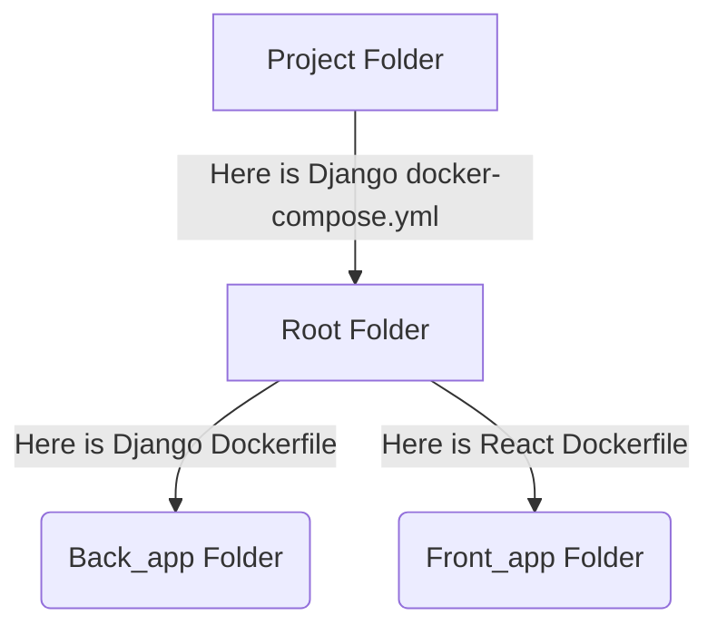
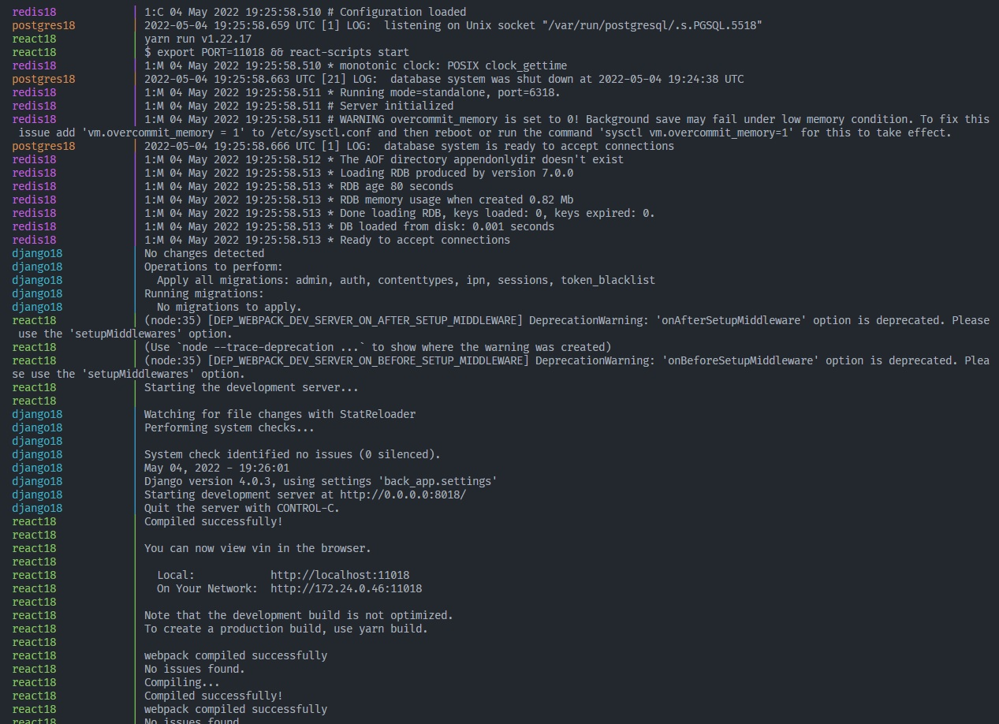

## Setup the project
### Installing docker compose

1. Download the Docker compose package:
>  sudo curl -L "https://github.com/docker/compose/releases/download/1.29.2/docker-compose-$(uname -s)-$(uname -m)" -o /usr/local/bin/docker-compose
2. Apply executable permissions to the binary:
> sudo chmod +x /usr/local/bin/docker-compose
3. Test the installation:
> docker-compose --version

## Run my Containers
1. Running my docker-compose file:
> docker-compose --env-file .env.dev up --build

## How to set my own docker containers for the project
### First of all we need to know the structure of our repo.

In the Root_folder we have our docker-compose.yml which call the others container for run our apps 
Back_app in this folder we have the dockerfile which have de Django config. 
Front_app in this folder we have the dockerfile which have de React config. 
### So what i need to edit for set my containers?
1. Edit our enviroment file, this could be .env.dev or .env.example with ***our info and port*** (remeber we gonna run this .env in the docker command)
2. Change de name of the containers to avoid conflicts For example: ***react18 to reactXX*** Where XX is your port.
3. Change the port ***for your port*** in the ***.env*** file of the front_app
4. Change the port ***for your port*** in the ***package.json*** in the line of start in the front_app
5. Reubicate your dir to root and run the docker compose file with:
> docker-compose --env-file .env.dev up --build

## Run my Containers
1. Running my docker-compose file:
> docker-compose --env-file .env.dev up --build
React app will run in the port 11018 [ReactApp](http://3.218.67.164:11018). 
Django app will run in the port 9018 [DjangoApp](http://3.218.67.164:9018). 
Postgres will run in the port 10018 [PostgresDB](http://3.218.67.164:10018). 
Redis will run in the port 11018 [RedisBD](http://3.218.67.164:12018). 
My ports ends in 18 because that was assigned to me but... you only need to change this one for your port.

## Solving your issues
- Issue #1 Running docker-compose up --build shows "You have a duplicated container name, change the name or delete this container": 
You will need to delete those containers which are already created by docker-compose: 
1. Check your containers ID with:  
> docker ps | grep XX   (Where xx is your port)
2. Stop every container that is avoiding conflicts:  
> docker stop MYCONTAINERID
3. Remove every container that is avoiding conflicts:  
> docker rm MYCONTAINERID
4. Run the docker-compose build again:  
> docker-compose --env-file .env.dev up --build
5. If everything is working your console will look like this:  

- Issue #2 Your Django migrations have conflict with other migrations in process or other issue with migrations. In this case i reset from zero the migrations.
1. Do makemigration for every app
> python manage.py makemigrations users
> python manage.py makemigrations market
> python manage.py makemigrations music
2. Reset every migration by zero
> python manage.py migrate --fake music zero
> python manage.py migrate --fake market zero
> python manage.py migrate --fake users zero 
3. Enter to your container
> docker exec -it djangoXX or my contianerID bash
4. Inside of your container run your migrations 
> pyhton manage.py migrate

- Issue #3 Your migrations doesn't work or you need to reset all of your postgres DB
1. Remove all your containers
> docker-compose down

2. Remove your postgres dir
> rm -rf postgres

3. Recreate your postgres dir
> mkdir postgres

4. Delete your migrations files

5. Run your docker compose build
> docker-compose --env-file .env.dev up --build

