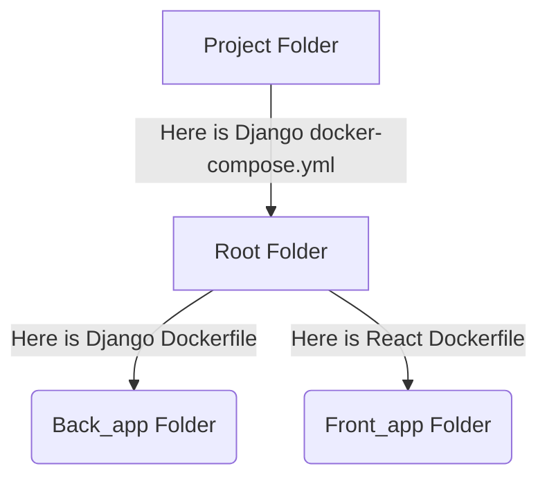

# Microservices for music app

## Setup
### Installing docker compose

1. Download the Docker compose package:
>  sudo curl -L "https://github.com/docker/compose/releases/download/1.29.2/docker-compose-$(uname -s)-$(uname -m)" -o /usr/local/bin/docker-compose
2. Apply executable permissions to the binary:
> sudo chmod +x /usr/local/bin/docker-compose
3. Test the installation:
> docker-compose --version

## Run my Containers
1. Running my docker-compose file:
> docker-compose --env-file .env.dev up --build
## How to set my own docker containers for the project
### First of all we need to know the structure of our repo.



In the Root_folder we have our docker-compose.yml which call the others container for run our apps
Back_app in this folder we have the dockerfile which have de Django config.
Front_app in this folder we have the dockerfile which have de React config.
### So what i need to edit for set my containers?
1. Edit our enviroment file, this could be .env.dev or .env.example with ***our info and port***
2. Change de name of the containers to avoid conflicts For example: ***react18 to reactXX*** Where XX is your port.
3. Change the port ***for your port*** in the ***.env*** file of the front_app
4. Change the port ***for your port*** in the ***package.json*** in the line of start in the front_app
5. Reubicate your dir to root and run the docker compose file with:
> docker-compose --env-file .env.dev up --build

## Run my Containers
1. Running my docker-compose file:
> docker-compose --env-file .env.dev up --build
React app will run in the port 11018 [ReactApp](http://3.218.67.164:11018).<br />
Django app will run in the port 9018 [DjangoApp](http://3.218.67.164:9018).<br />
Postgres will run in the port 10018 [PostgresDB](http://3.218.67.164:10018).<br />
Redis will run in the port 11018 [RedisBD](http://3.218.67.164:12018).<br />
My ports ends in 18 because that was assigned to me but you only need to change this one for your port.


## Solving your issues
- Issue #1 Running docker-compose up --build shows "": Postgres images runs some configuration only the first time we build and run our container. In order for solving this issue we must stop our current container with CTRL C, then enter following commands:
```
docker-compose rm web
docker-compose rm postgres_db
docker-compose up --build
```

- Issue #2 Password authentication failed for your user and also Issue #3 Connection refused, Is the server running on that host and accepting TCP/IP connections: These errors occurs when we are trying to access to an unavailable instance of Postgres or if we tried to access Postgres in some IP server that doesn't have Postgres expose on any port, we must use the right IP for postgres. We need to obtain our IP address of our network containers, in order for that we need to write the following commands:

```
# First we need to obtain our container ID
docker ps | grep YOUR_PORT

# Once you grep some instance with your related port, copy the ID 
# and paste it on the next command
docker inspect -f '{{range.NetworkSettings.Networks}}{{.IPAddress}}{{end}}' YOUR_CONTAINER_ID
```
Then we need to use that IP address in our docker-compose.yml because it corresponds to the IP address of our Docker network.
